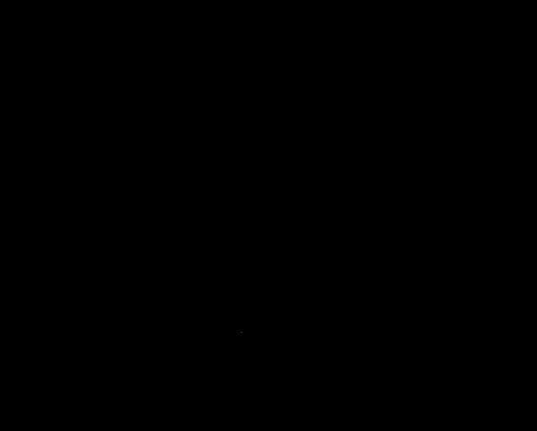

  <h1>SOLiD</h1>
  
  
  
	
  
	
  

  

    This repository is the official code for Narrowing your FOV with SOLiD: Spatially Organized and Lightweight Global Descriptor for FOV-constrained LiDAR Place Recognition. (IEEE RA-L)
  

 

  

## Note
* SOLiD can be integrated with various LiDAR odometry including solid-state LiDAR.
	* (TBD) Integrated with A-LOAM: [SOLiD-A-LOAM](https://github.com/sparolab/SOLiD-A-LOAM.git)

## NEWS
* [August, 2024] Code will be released in August!!
* [July, 2024] SOLiD is accepted in RA-L!!

## Supplementary
* [Arxiv](https://arxiv.org/abs/2408.07330#)
* [Paper](https://ieeexplore.ieee.org/abstract/document/10629042)
* [Video](https://www.youtube.com/watch?v=4sAWWfZTwLs)
* [Project page](https://sites.google.com/view/lidar-solid)

## Main Contribution
* [Hogyun Kim](https://scholar.google.com/citations?user=t5UEbooAAAAJ&hl=ko)
* [Jiwon Choi](https://scholar.google.com/citations?user=wL8VdUMAAAAJ&hl=ko)
* [Taehu Sim](https://scholar.google.com/citations?user=UPg-JuQAAAAJ&hl=ko)
* [Giseop Kim](https://scholar.google.com/citations?user=9mKOLX8AAAAJ&hl=ko)
* [Younggun Cho](https://scholar.google.com/citations?user=W5MOKWIAAAAJ&hl=ko)

## Citation
<pre>
<code>
@article{kim2024narrowing,
  title={Narrowing your FOV with SOLiD: Spatially Organized and Lightweight Global Descriptor for FOV-constrained LiDAR Place Recognition},
  author={Kim, Hogyun and Choi, Jiwon and Sim, Taehu and Kim, Giseop and Cho, Younggun},
  journal={IEEE Robotics and Automation Letters},
  year={2024},
  publisher={IEEE}
}</code>
</pre>  

## Contact
* Hogyun Kim (hg.kim@inha.edu)
