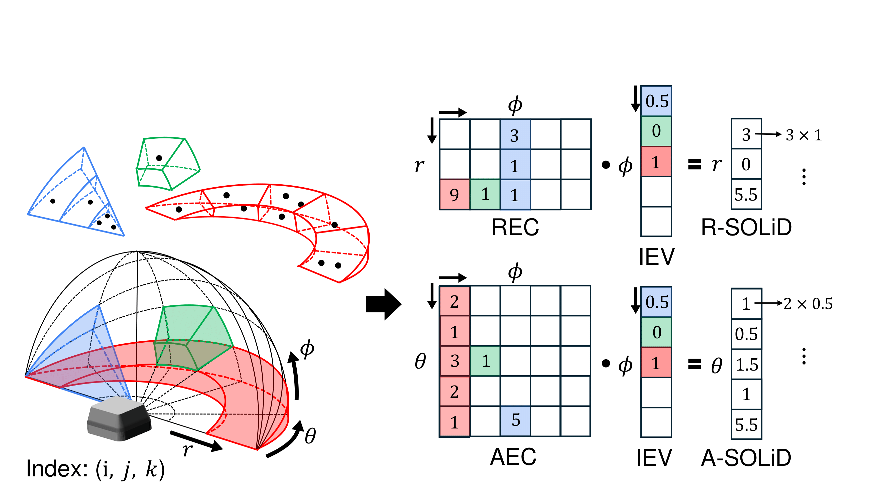
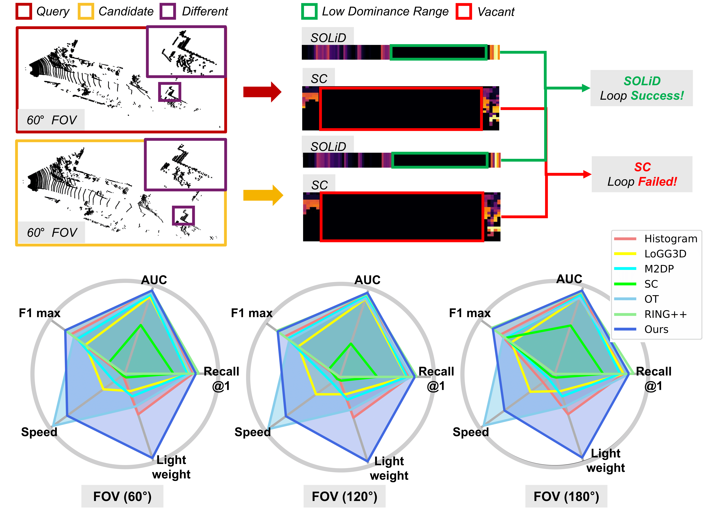

  <h1>SOLiD</h1>
  
  
  
  
  
  
   
   

**[IEEE RA-L]** This repository is the official code for Narrowing your FOV with **SOLiD**: Spatially Organized and Lightweight Global Descriptor for FOV-constrained LiDAR Place Recognition.

  

  

## NEWS
* [August, 2024] The SOLiD is added in [awesome-lidar-place-recognition](https://github.com/hogyun2/awesome-lidar-place-recognition)!!
* [August, 2024] Now, the SOLiD code is released!!
* [July, 2024] SOLiD is accepted in RA-L!!

## Note
* SOLiD can be integrated with various LiDAR odometry including solid-state LiDAR.
	* (TBD) Integrated with A-LOAM: [SOLiD-A-LOAM](https://github.com/sparolab/SOLiD-A-LOAM.git)
	* (TBD) Integrated with LOAM-LIVOX: [SOLiD-LOAM-LIVOX](https://github.com/sparolab/SOLiD-A-LOAM.git)
	* (TBD) Integrated with a basic ICP odometry: [PyICP-SOLiD-SLAM](https://github.com/sparolab/SOLiD-A-LOAM.git)
		* This implementation is fully python-based so slow but educational purpose.
		* KD-Tree version is here.

## What are the problems with traditional LiDAR Place Recognition?
* The traditional method uses a bird eye view and overlooks vertical information.
* Also, because it focuses on performance, it is difficult to apply in real-time on an onboard computer.
  

## What is the SOLiD?
* SOLiD is a lightweight and fast LiDAR global descriptor for FOV constraints situations that are limited through fusion with other sensors or blocked by robot/sensor operators including mechanical components or solid-state LiDAR (e.g. Livox).
  

## How to use the SOLiD?
* Python version
	* If you use the other LiDAR sensor, you modify the parameters in parser of test.py and lidar file structure in utils/point_module.py.
<pre>
<code>
    $ git clone https://github.com/sparolab/solid.git
    $ cd python
    $ python3 test.py
</code>
</pre>  

* Cpp version
	* If you use the other LiDAR sensor, you modify the parameters in include/solid_module.h.

<pre>
<code>
    $ git clone https://github.com/sparolab/solid.git
    $ cd cpp
    $ mkdir build
    $ cd build
    $ cmake ..
    $ make
    $ ./test_solid
</code>
</pre>  

## Utils
* If you want to clip the points, you can use python/bin/point_clipper.py
<pre>
<code>
    $ git clone https://github.com/sparolab/solid.git
    $ cd python/bin/
    $ python3 point_clipper.py
</code>
</pre>  

## Supplementary
* [Arxiv](https://arxiv.org/abs/2408.07330#)
* [Paper](https://ieeexplore.ieee.org/abstract/document/10629042)
* [Video](https://www.youtube.com/watch?v=4sAWWfZTwLs)
* [Project page](https://sites.google.com/view/lidar-solid)

## Main Contribution
* [Hogyun Kim](https://scholar.google.com/citations?user=t5UEbooAAAAJ&hl=ko)
* [Jiwon Choi](https://scholar.google.com/citations?user=wL8VdUMAAAAJ&hl=ko)
* [Taehu Sim](https://scholar.google.com/citations?user=UPg-JuQAAAAJ&hl=ko)
* [Giseop Kim](https://scholar.google.com/citations?user=9mKOLX8AAAAJ&hl=ko)
* [Younggun Cho](https://scholar.google.com/citations?user=W5MOKWIAAAAJ&hl=ko)

## QnA
* If you have a question, you utilize a [alphaxiv](https://www.alphaxiv.org/abs/2408.07330) and comment here.
## Citation
<pre>
<code>
@article{kim2024narrowing,
  title={Narrowing your FOV with SOLiD: Spatially Organized and Lightweight Global Descriptor for FOV-constrained LiDAR Place Recognition},
  author={Kim, Hogyun and Choi, Jiwon and Sim, Taehu and Kim, Giseop and Cho, Younggun},
  journal={IEEE Robotics and Automation Letters},
  year={2024},
  publisher={IEEE}
}</code>
</pre>  

## Contact
* Hogyun Kim (hg.kim@inha.edu)
